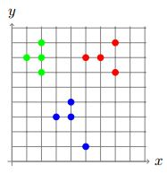

# kruskal-clustering
Clustering Algorithm based on Kruskal's Minimum Spanning Tree Algorithm

## Introduction
Clustering is a fundamental problem in data mining. The goal is to partition
a given set of objects into subsets (or clusters) in such a way that any two
objects from the same subset are close (or similar) to each other, while any
two objects from different subsets are far apart.

### Problem Description
#### Task:
Given _n_ points on a plane and an integer _K_, compute the largest possible value of _d_ such that the
given points can be partitioned into _k_ non-empty subsets in such a way that the distance between any
two points from different subsets is at least _d_.

#### Input Format:
The frst line contains the number _n_ of points. Each of the following _n_ lines defnes a point
(_x(i)_, _y(i)_). The last line contains the number _k_ of clusters.

#### Constraints:
2 ≤ _k_ ≤ _n_ ≤ 200; −10^3 ≤ _x(i)_,_y(i)_ ≤ 10^3 are integers. All points are pairwise different.

#### Output Format: 
Output the largest value of _d_. The absolute value of the difference between the answer of
this program and the optimal value is at most 10^−6. To ensure this, we output the answer with
at least seven digits after the decimal point.

### Example
**Input:**
```
12
7 6
4 3
5 1
1 7
2 7
5 7
3 3
7 8
2 8
4 4
6 7
2 6
3
```
**Output:**
```
2.828427124746
```

The answer is `math.sqrt(8)`. The corresponding partition of the set of points into three clusters is shown below.

